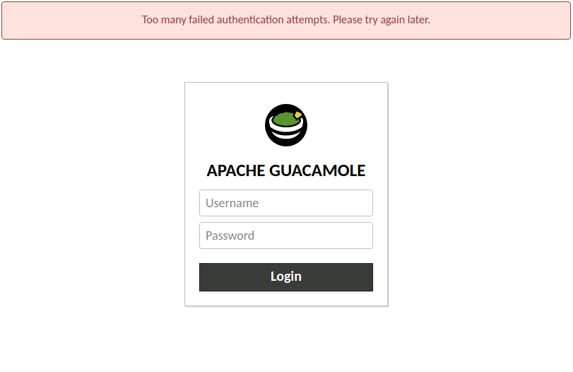

Securing Guacamole against brute force attacks
==============================================

Version 1.6.0 of Guacamole introduces an extension that allows you to detect
and block brute-force login attacks. The extension, `guacamole-auth-ban`, can
be installed alongside any of Guacamole's other extensions that provide user
authentication, and will track the IP address of failed authentication attempts
and, once the threshold of failed logins is reached, will block further logins
from that IP address for a given amount of time.

:::{important}
This chapter involves modifying the contents of `GUACAMOLE_HOME` - the
Guacamole configuration directory. If you are unsure where `GUACAMOLE_HOME` is
located on your system, please consult  before
proceeding.
:::

Downloading the auth-ban extension
----------------------------------

The guacamole-auth-ban extension is available separately from the main
`guacamole.war`. The link for this and all other officially-supported and
compatible extensions for a particular version of Guacamole are provided on the
release notes for that version. You can find the release notes for current
versions of Guacamole here: http://guacamole.apache.org/releases/.

The extension is packaged as a `.tar.gz` file containing only the extension
itself, `guacamole-auth-ban-1.6.0.jar`, which must ultimately be placed in
`GUACAMOLE_HOME/extensions`.

(installing-auth-ban)=

Installing the auth-ban extension
---------------------------------

Guacamole extensions are self-contained `.jar` files which are located within
the `GUACAMOLE_HOME/extensions` directory. To install the guacamole-auth-ban
extension, you must:

1. Create the `GUACAMOLE_HOME/extensions` directory, if it does not already
   exist.

2. Copy `guacamole-auth-ban-1.6.0.jar` within `GUACAMOLE_HOME/extensions`.

3. [Configure the auth-ban extension thresholds, as described below](auth-ban-config),
   if want parameters other than the defaults (also noted below).

:::{important}
You will need to restart Guacamole by restarting your servlet container in
order to complete the installation. Doing this will disconnect all active
users, so be sure that it is safe to do so prior to attempting installation.
:::

(auth-ban-config)=

### Configuring Guacamole for authentication failure protection

This extension has no required properties, and, so long as you are satisfied
with the default threshold noted below, requires no configuration beyond the
installation of the extension and reload of the web application.

If you wish to adjust the thresholds for how Guacamole handles protection
against brute force authentication attacks, the following properties are
available to you to configure the auth-ban extension:

`ban-max-invalid-attempts`
: The number of authentication failures ater which the extension will block
  further logins from the client IP address. This property is optional and
  the default is 5.

`ban-address-duration`
: The length of time for which a client IP address will be denied logins
  after the maximum authentication failures, in seconds. This property is
  optional and has a default value of 300 seconds (five minutes).

`ban-max-addresses`
: The maximum number of client IP addresses that the extension will track
  in-memory before the oldest client IP is discarded in a Least-Recently
  Used (LRU) fashion. This property is optional and has a default value
  of 10485670 (1 million IP addresses).

:::{important}
Because the extension tracks authentication failures based on the client
IP address, it is important to make sure that Guacamole is receiving the
correct IP addresses for the clients. This is particularly noteworthy
when Guacamole is behind a reverse proxy. See the manual page on
[proxying Guacamole](proxying-guacamole) for more details on configuring
Guacamole behind a proxy.
:::

(completing-auth-ban-install)=

### Completing the installation

Guacamole will only reread `guacamole.properties` and load newly-installed
extensions during startup, so your servlet container will need to be restarted
before installation of the auth-ban extension will take effect.

(using-auth-ban)=

### Using the extension

Once the extension is installed and the web application restarted, Guacamole
will immediately begin tracking login failures and blocking login attempts
from systems that reach the maximum failure threshold. Once an IP address is
blocked you'll see a message on the login page:

