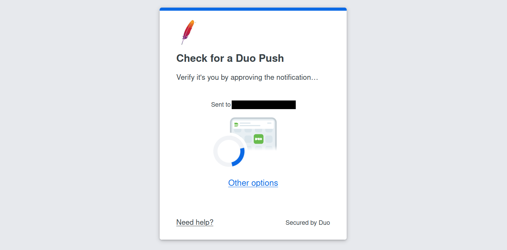
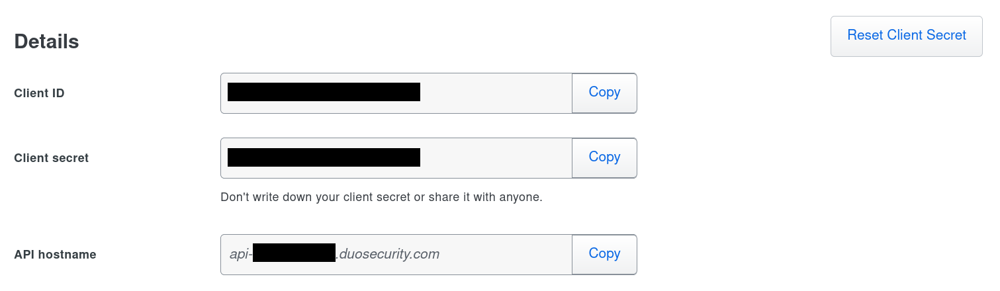

---
myst:
  substitutions:
    extArchiveName: guacamole-auth-duo
    extJarName:     guacamole-auth-duo
---

Duo two-factor authentication
=============================

Guacamole's Duo authentication extension allows the third-party Duo service to
be used as an additional authentication factor for users of your Guacamole
installation. If installed, users that attempt to authenticate against
Guacamole will be sent to Duo's service for further verification.

```{include} include/warn-config-changes.md
```

(duo-architecture)=

How Duo works with Guacamole
----------------------------

Duo is strictly a service for verifying the identities of users that have
already been partially verified through another authentication method. Thus,
for Guacamole to make use of Duo, at least one other authentication mechanism
will need be configured, such as [a supported database](jdbc-auth) or
[LDAP](ldap-auth).

When a user attempts to log into Guacamole, other installed authentication
methods will be queried first:


Only after authentication has succeeded with one of those methods will
Guacamole reach out to Duo to obtain additional verification of user
identity:



If both the initial authentication attempt and verification through Duo
succeed, the user will be allowed in. If either mechanism fails, access
to Guacamole is denied.

Adding Guacamole to Duo
-----------------------

Duo does not provide a specific integration option for Guacamole, but
Guacamole's Duo extension uses Duo's generic authentication API which
they refer to as the "Web SDK". To use Guacamole with Duo, you will need
to add it as a new "Web SDK" application from within the "Applications"
tab of the admin panel of your Duo account:


Within the settings of the newly-added application, rename the
application to something more representative than "Web SDK". This
application name is what will be presented to your users when they are
prompted by Duo for additional authentication:


Once you've finished adding Guacamole as a "Web SDK" application, the
information required to configure Guacamole is listed within the application's
"Details" section. You will need to copy the client ID, secret, and API
hostname - they will later be specified within `guacamole.properties`:



(duo-downloading)=

Downloading and Installing the Duo extension
--------------------------------------------

```{include} include/ext-download.md
```

(guac-duo-config)=

Configuring Guacamole for Duo
-----------------------------

```{eval-rst}
.. tab:: Native Webapp (Tomcat)

   If deploying Guacamole natively, you will need to add a section to your
   ``guacamole.properties`` that looks like the following:

   .. literalinclude:: include/duo.example.properties
      :language: ini

   The properties that must be set in all cases for any Guacamole installation
   using Duo are:

   .. include:: include/duo.properties.md
      :parser: myst_parser.sphinx_

.. tab:: Container (Docker)

   If deploying Guacamole using Docker Compose, you will need to add a set of
   environment varibles to the ``environment`` section of your
   ``guacamole/guacamole`` container that looks like the following 

   .. literalinclude:: include/duo.example.yml
      :language: yaml

   If instead deploying Guacamole by running ``docker run`` manually, these
   same environment variables will need to be provided using the ``-e`` option.
   For example:

   .. literalinclude:: include/duo.example.txt
      :language: console

   The environment variables that must be set in all cases for any Docker-based
   Guacamole installation using Duo are:

   .. include:: include/duo.environment.md
      :parser: myst_parser.sphinx_
```

### Bypass/Enforce Duo for Specific Hosts

By default, when the Duo module is enabled, Duo-based MFA will be enforced for
all users that attempt to log in to Guacamole, regardless of where they are
connecting from. Depending on your use case, it may be necessary to narrow this
behavior and only enforce Duo-based MFA for certain hosts and bypass it for
others.

```{include} include/ext-client-ips.md
```

```{eval-rst}
.. tab:: Native Webapp (Tomcat)

   Duo-based MFA can be explicitly bypassed or enforced on a per-host basis by
   providing the relevant, exhaustive list of addresses/networks using either
   of the following properties:

   .. include:: include/duo-bypass-enforce.properties.md
      :parser: myst_parser.sphinx_

.. tab:: Container (Docker)

   Duo-based MFA can be explicitly bypassed or enforced on a per-host basis by
   providing the relevant, exhaustive list of addresses/networks using either
   of the following environment variables:

   .. include:: include/duo-bypass-enforce.environment.md
      :parser: myst_parser.sphinx_

```

### Additional Configuration Options

```{eval-rst}
.. tab:: Native Webapp (Tomcat)

   The following additional, optional properties may be set as desired to
   tailor the behavior of the Duo support:

   .. include:: include/duo-optional.properties.md
      :parser: myst_parser.sphinx_

.. tab:: Container (Docker)

   The following additional, optional environment variables may be set as
   desired to tailor the behavior of the Duo support:

   .. include:: include/duo-optional.environment.md
      :parser: myst_parser.sphinx_

   You can also explicitly enable/disable use of Duo support by setting the
   ``DUO_ENABLED`` environment variable to ``true`` or ``false``:

   ``DUO_ENABLED``
      Explicitly enables or disables use of the Duo extension. By default, the
      Duo extension will be installed only if at least one Duo-related
      environment variable is set.

      If set to ``true``, the Duo extension will be installed regardless of any
      other environment variables. If set to ``false``, the Duo extension will
      NOT be installed, even if other Duo-related environment variables have
      been set.
```

(completing-duo-install)=

Completing the Installation
---------------------------

```{include} include/ext-completing.md
```

