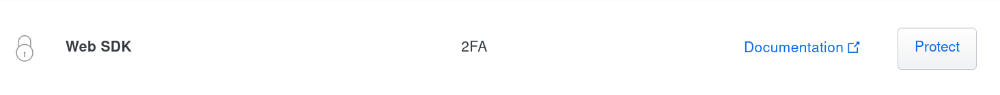

Duo two-factor authentication
=============================

Guacamole supports Duo as a second authentication factor, layered on top
of any other authentication extension, including those available from
the main project website. The Duo authentication extension allows users
to be additionally verified against the Duo service before the
authentication process is allowed to succeed.

:::{important}
This chapter involves modifying the contents of `GUACAMOLE_HOME` - the
Guacamole configuration directory. If you are unsure where `GUACAMOLE_HOME` is
located on your system, please consult  before
proceeding.
:::

(duo-architecture)=

How Duo works with Guacamole
----------------------------

Guacamole provides support for Duo as a second authentication factor. To
make use of the Duo authentication extension, some other authentication
mechanism will need be configured, as well. When a user attempts to log
into Guacamole, other installed authentication methods will be queried
first:

Only after authentication has succeeded with one of those methods will
Guacamole reach out to Duo to obtain additional verification of user
identity:

If both the initial authentication attempt and verification through Duo
succeed, the user will be allowed in. If either mechanism fails, access
to Guacamole is denied.

(duo-downloading)=

Downloading the Duo extension
-----------------------------

The Duo authentication extension is available separately from the main
`guacamole.war`. The link for this and all other officially-supported
and compatible extensions for a particular version of Guacamole are
provided on the release notes for that version. You can find the release
notes for current versions of Guacamole here:
<http://guacamole.apache.org/releases/>.

The Duo authentication extension is packaged as a `.tar.gz` file
containing only the extension itself, `guacamole-auth-duo-1.6.0.jar`,
which must ultimately be placed in `GUACAMOLE_HOME/extensions`.

(installing-duo-auth)=

Installing Duo authentication
-----------------------------

Guacamole extensions are self-contained `.jar` files which are located
within the `GUACAMOLE_HOME/extensions` directory. To install the Duo
authentication extension, you must:

1. Create the `GUACAMOLE_HOME/extensions` directory, if it does not already
   exist.

2. Copy `guacamole-auth-duo-1.6.0.jar` within `GUACAMOLE_HOME/extensions`.

3. Configure Guacamole to use Duo authentication, as described below.

:::{important}
You will need to restart Guacamole by restarting your servlet container in
order to complete the installation. Doing this will disconnect all active
users, so be sure that it is safe to do so prior to attempting installation. If
you do not configure the Duo authentication properly, Guacamole will not start
up again until the configuration is fixed.
:::

### Adding Guacamole to Duo

Duo does not provide a specific integration option for Guacamole, but
Guacamole's Duo extension uses Duo's generic authentication API which
they refer to as the "Web SDK". To use Guacamole with Duo, you will need
to add it as a new "Web SDK" application from within the "Applications"
tab of the admin panel of your Duo account:

Within the settings of the newly-added application, rename the
application to something more representative than "Web SDK". This
application name is what will be presented to your users when they are
prompted by Duo for additional authentication:

Once you've finished adding Guacamole as a "Web SDK" application, the
information required to configure Guacamole is listed within the application's
"Details" section. You will need to copy the client ID, secret, and API
hostname - they will later be specified within `guacamole.properties`:

(guac-duo-config)=

### Configuring Guacamole for Duo

The application-specific configuration information retrieved from Duo
must be added to `guacamole.properties` to describe how Guacamole
should connect to the Duo service:

`duo-api-hostname`
: The hostname of the Duo API endpoint to be used to verify user identities.
  This will usually be in the form {samp}`api-{XXXXXXXX}.duosecurity.com`,
  where {samp}`{XXXXXXXX}` is some arbitrary alphanumeric value assigned by
  Duo. This value will have been generated by Duo when you added Guacamole as
  a "Web SDK" application, and can be found within the application details in
  the "API hostname" field. *This value is required.*

`duo-client-id`
: The unique client ID provided for Guacamole by Duo. This value will
  have been generated by Duo when you added Guacamole as a "Web SDK"
  application, and can be found within the application details in the
  "Client ID" field. *This value is required.*

  This value was formerly known as the "integration key" in older versions of
  Duo's "Web SDK" and was configured with the `duo-integration-key` property
  in older versions of Guacamole.

`duo-client-secret`
: The shared secret provided for Guacamole by Duo. This value will have been
  generated by Duo when you added Guacamole as a "Web SDK" application, and can
  be found within the application details in the "Client secret" field. *This
  value is required.*

  This value was formerly known as the "secret key" in older versions of Duo's
  "Web SDK" and was configured with the `duo-secret-key` property in older
  versions of Guacamole.

`duo-redirect-uri`
: The URI that should be submitted to the Duo service such that they can
  redirect the authenticated user back to Guacamole after the authentication
  process is complete. This must be the full URL that a user would enter into
  their browser to access Guacamole. *This value is required.*

`duo-auth-timeout`
: The maximum amount of time to wait for a user to finish authenticating with
  Duo, in minutes. Any authentication attempt that takes longer than this
  amount of time will be rejected, requiring the user to reenter their
  credentials and possibly revalidate their identity with Duo. By default,
  login attempts are allowed to take up to 5 minutes.

`duo-bypass-hosts`
: By default, when the Duo module is enabled, Duo-based MFA will be enforced
  for all users, from all clients, that attempt to log in to Guacamole.
  This option allows for the Duo requirement to be bypassed for users logging
  in from a specified set of hosts. This option can contain a comma-separated
  list of IP addresses and/or subnets, in CIDR notation, for which Duo
  MFA should not be required. This may be useful in scenarios where a single
  Guacamole instance is used by both users inside and outside a network
  boundary such that the users inside the boundary (VPN or Firewall) have
  already achieved a certain level of authentication and do not need the
  second layer of security, whereas users outside that boundary still
  require the additional authentication layer.

  This property is optional, and there is no default value. If no value
  is specified, the Duo module will require that all users from all sources
  complete the secondary authentication.

`duo-enforce-hosts`
: Similar to the `duo-bypass-hosts` option above, this option specifies
  hosts for which the Duo MFA must absolutely be enforced. This option
  helps provide flexibility in environments where you know that untrusted
  connections will be coming in from a certain IP address or subnet so
  that you can enforce the secondary authentication for those sources.
  This value is optional with no default value.

:::{important}
  There are two items that are important to note about the above options
  for either bypassing or enforcing Duo logins based on IP address. First,
  it is important that Tomcat and any upstream proxies (Nginx, Apache, etc.)
  be properly configured to present the client IP address that will be used
  to determine "trusted" vs. "untrusted" clients. This means configuring
  Tomcat and the upstream proxies in such a way as to correctly forward
  the client IP address information through to Guacamole, as documented
  in the chapter on .

  Second, it's important to understand the various behaviors of these
  options as they interact with each other. There are four possible
  scenarios:

  1. Neither option is specified. In this case, the Duo module
     enforces secondary authentication for all clients.
     This is, obviously, the most secure scenario.

  2. You specify a list of IP addresses or subnets in the
     `duo-bypass-hosts` property and do not specify any in the
     `duo-enforce-hosts` property. In this scenario, Duo will
     only bypass enforcement of the second authentication
     mechanism for users logging in from hosts that fall
     in the provided list, and will enforce second factor
     authentication for users from all other clients.

  3. You do not specify any hosts or subnets in the
     `duo-bypass-hosts` property, but you specify one or more
     hosts or subnets in the `duo-enforce-hosts` property.
     In this scenario, Duo will ONLY enforce second factor
     authentication for the hosts that fall into the list of
     enforced hosts, and users from all other clients will
     be able to log on without the second authentication
     factor.

  4. You specify values for both the bypass and the enforce
     lists, in which case only hosts listed in the enforce
     list will actually have second factor authentication
     enforced, and the bypass list will essentially be
     meangingless, as all other hosts will be bypassed.

     The one item to note in this scenario is what happens
     if there is an overlap between the bypass list and the
     enforce list, where a host is either specified in both
     lists or is specified in one list but falls into a CIDR
     range specified in the other list. In these cases,
     the enforce list will always take precendence over
     the bypass list, and Duo MFA will be enforced.
:::

(completing-duo-install)=

### Completing the installation

Guacamole will only reread `guacamole.properties` and load newly-installed
extensions during startup, so your servlet container will need to be restarted
before Duo authentication will take effect.  Restart your servlet container and
give the new authentication a try.

:::{important}
You only need to restart your servlet container. *You do not need to restart
guacd*.

guacd is completely independent of the web application and does not deal with
`guacamole.properties` or the authentication system in any way. Since you are
already restarting the servlet container, restarting guacd as well technically
won't hurt anything, but doing so is completely pointless.
:::

If Guacamole does not come back online after restarting your servlet
container, check the logs. Problems in the configuration of the Duo
extension may prevent Guacamole from starting up, and any such errors
will be recorded in the logs of your servlet container.

