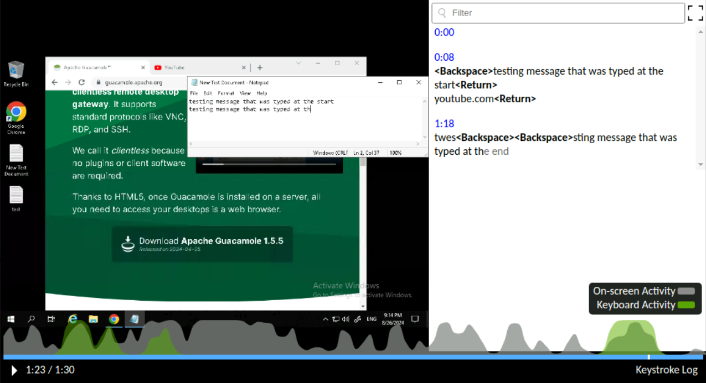
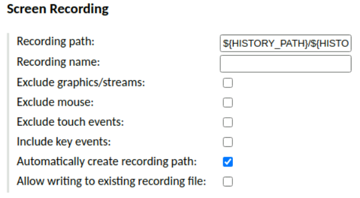
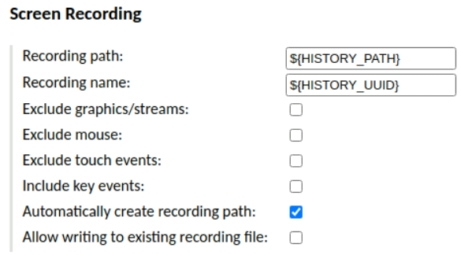

Viewing session recordings in-browser
=====================================

Guacamole supports [recording activity within remote desktop sessions](graphical-recording)
such that it can be played back and reviewed later. Graphical recordings can be
converted to video [using the `guacenc` tool](graphical-recording) (part of
[guacamole-server](building-guacamole-server)) or can be played back directly
in the browser in their native format using Guacamole itself. This has several
benefits:

* Recordings can be played back while the session is underway.
* Recordings need not be re-encoded as traditional video, an
  intensive process that often results in a larger file.
* It is very easy to locate and play back the recording for a session when
  doing so only involves clicking a button in the connection history.

This chapter of the documentation covers installing and using the extension
that allows recordings stored on disk to be played back in the browser.

:::{important}
This chapter involves modifying the contents of `GUACAMOLE_HOME` - the
Guacamole configuration directory. If you are unsure where `GUACAMOLE_HOME` is
located on your system, please consult [](configuring-guacamole) before
proceeding.
:::

(playback-architecture)=

How recording storage and playback works
----------------------------------------

The Guacamole web application includes its own support for playing back
recordings from the history screen in the administration interface, but that
support cannot automatically know where those recordings are stored nor how
they are named. The extension documented here provides exactly that missing
piece, allowing the web application to find recordings on disk so long as they
are named appropriately and stored in a specific location.

Each history entry has a deterministic, internal, unique identifier called its
UUID, and all supported database backends make this UUID available ahead of
time with the `${HISTORY_UUID}` parameter token. This provides a reliable way
for data stored _outside_ the database to be associated with history entries
that are otherwise stored purely _inside_ the database, and it is this UUID
that the extension searches for when locating the recording for a history entry.

When a user lists the history of a connection, the recording storage extension
additionally [searches a predetermined location](recording-storage-config) for
session recordings that match either of the following criteria:

* The recording's filename is _identical_ to the history entry UUID and is
  directly within the search path.

* The recording has any name at all and is within a directory whose filename is
  identical to the history entry UUID and is directly within the search path.

If such a recording is found, it is made available to any user that can view
the history entry. The availability of a recording is displayed as a "View"
link in the "Logs" column of the history table:


Clicking on that link navigates to a screen with a player that loads the
recording and allows it to be played back:


Version 1.6.0 of Guacamole introduces a feature that allows for key events
in the recording to be displayed in a format similar to the guaclog utility,
making it easy for administrators to scroll or search through the output
for key events. The amount and type of data shown in this output will
depend upon the options selected when recording is enabled - for example,
keystrokes will not be available if keystroke logging has not been
enabled for a connection.



(playback-downloading)=

Downloading the recording storage extension
-------------------------------------------

The recording storage extension is available separately from the main
`guacamole.war`. The link for this and all other officially-supported and
compatible extensions for a particular version of Guacamole are provided on the
release notes for that version. You can find the release notes for current
versions of Guacamole here: http://guacamole.apache.org/releases/.

The recording storage extension is packaged as a `.tar.gz` file containing only
the extension itself, `guacamole-history-recording-storage-1.5.5.jar`, which
must ultimately be placed in `GUACAMOLE_HOME/extensions`.

(installing-recording-storage)=

Installing the recording storage extension
------------------------------------------

Guacamole extensions are self-contained `.jar` files which are located within
the `GUACAMOLE_HOME/extensions` directory. To install the recording storage
extension, you must:

1. Create the `GUACAMOLE_HOME/extensions` directory, if it does not already
   exist.

2. Copy `guacamole-history-recording-storage-1.5.5.jar` within
   `GUACAMOLE_HOME/extensions`.

3. [Configure your connections to store their recordings within the path
   searched by the recording storage extension, as described below.](recording-storage-connection-config)

:::{important}
You will need to restart Guacamole by restarting your servlet container in
order to complete the installation. Doing this will disconnect all active
users, so be sure that it is safe to do so prior to attempting installation. If
you do not configure the recording storage extension properly, Guacamole will not
start up again until the configuration is fixed.
:::

(prepare-recording-storage)=

### Preparing a directory for recording storage

By default, the recording storage extension will search within
`/var/lib/guacamole/recordings` for the recordings associated with a
connection. Unless you or a third-party installation tool have created this
directory, this directory will not exist and you will need to create it
manually:

```console
$ mkdir -p /var/lib/guacamole/recordings
```

You can also use another directory of your own choosing if you
[override the default location using the `recording-search-path`
property](recording-storage-config).

:::{important}
The following steps will use `/var/lib/guacamole/recordings`, as it is a
sensible location and the default search path. If you are using a different
path, consider `/var/lib/guacamole/recordings` below to be a placeholder and
use your own path instead.
:::

Once the path has been created, its permissions and ownerships must be modified
such that _both of the following are true_:

* The guacd service can write to the directory.
* The servlet container (typically Tomcat) can read from the directory, as well
  as read any files that are placed within the directory.

The simplest way to do this is to ensure that:

1. The directory is owned by the user that runs the guacd service and the
   _group_ that runs the Tomcat service.
2. The directory has read/write/execute permissions for the user (so that guacd
   can write here), and read/execute/**setgid** permissions for the group (so
   that Tomcat can read here, and so that [any files placed here are automatically
   owned by the Tomcat user's group](https://en.wikipedia.org/wiki/Setuid#When_set_on_a_directory)).

For example, if your guacd service runs as a dedicated `guacd` user, and your
Tomcat service runs as a user within the `tomcat` group:

```console
$ chown guacd:tomcat /var/lib/guacamole/recordings
$ chmod 2750 /var/lib/guacamole/recordings
```

If set correctly, the ownerships and permissions should look like:

```console
$ ls -ld /var/lib/guacamole/recordings
drwxr-s---. 1 guacd tomcat 0 Feb  5 05:43 /var/lib/guacamole/recordings/
$
```

(recording-storage-config)=

### Configuring Guacamole for recording storage

The recording storage extension has no required properties and typically does
not need to be configured beyond (1) creating the storage directory [as
described above](prepare-recording-storage) and (2) configuring connections to
use that storage directory [as described below](recording-storage-connection-config).
Configuration is only necessary if you wish to use a storage location other
than the default `/var/lib/guacamole/recordings`.

If you wish to use a different storage location than
`/var/lib/guacamole/recordings`, the following property must be added to
`guacamole.properties`:

`recording-search-path`
: The directory to search for associated session recordings. This property is
  optional. By default, `/var/lib/guacamole/recordings` will be used.

(completing-recording-storage-install)=

### Completing the installation

Guacamole will only reread `guacamole.properties` and load newly-installed
extensions during startup, so your servlet container will need to be restarted
before installation of the recording storage extension will take effect.
Restart your servlet container, configure a connection to use the new storage,
and give in-browser playback a try.

:::{important}
You only need to restart your servlet container. *You do not need to restart
guacd*.

guacd is completely independent of the web application and does not deal with
`guacamole.properties` or extensions in any way. Since you are already
restarting the servlet container, restarting guacd as well technically won't
hurt anything, but doing so is completely pointless.
:::

If Guacamole does not come back online after restarting your servlet container,
check the logs. Problems in the configuration of the recording storage
extension may prevent Guacamole from starting up, and any such errors will be
recorded in the logs of your servlet container.

(recording-storage-connection-config)=

Configuring connections to use recording storage
------------------------------------------------

Recordings of connections can be found by the recording storage extension as
long as those connections are configured in either of two ways, each involving
naming a file or directory with the history UUID (`${HISTORY_UUID}`).

### Option 1: Using a subdirectory named with the history UUID (RECOMMENDED)

If the recording path of a connection is set to
`${HISTORY_PATH}/${HISTORY_UUID}` and "automatically create path" is checked,
then the recording storage extension will be able to locate the recording by
recognizing that the directory is named with the UUID:



**This is the recommended method of storing recordings.** This method is the
most flexible in that it allows other recordings like typescripts to be stored
within the same directory, and it allows recordings to be given _any_ name,
including names that are more human-readable, contain [`${GUAC_DATE}` or
`${GUAC_TIME}` tokens](parameter-tokens), etc.

Though the web application does not currently support in-browser playback of
typescripts, server logs, or other files that might be of interest to the
administrator looking at the history of a connection, it _does_ recognize these
files. Following this method will allow any future support for playback of
other types of recordings to work even for old recordings.

### Option 2: Naming the recording with the history UUID

If the recording path of a connection is set to `${HISTORY_PATH}` and the
recording name is set to `${HISTORY_UUID}`, the recording storage extension
will be able to locate the recording by recognizing that its name is identical
to the UUID:



